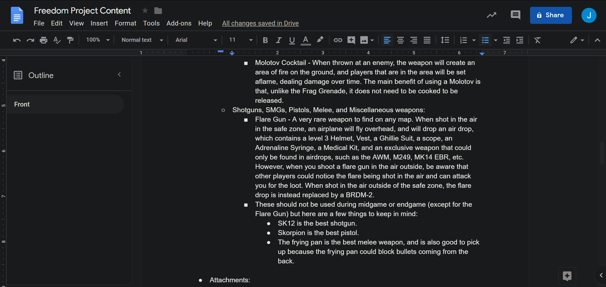
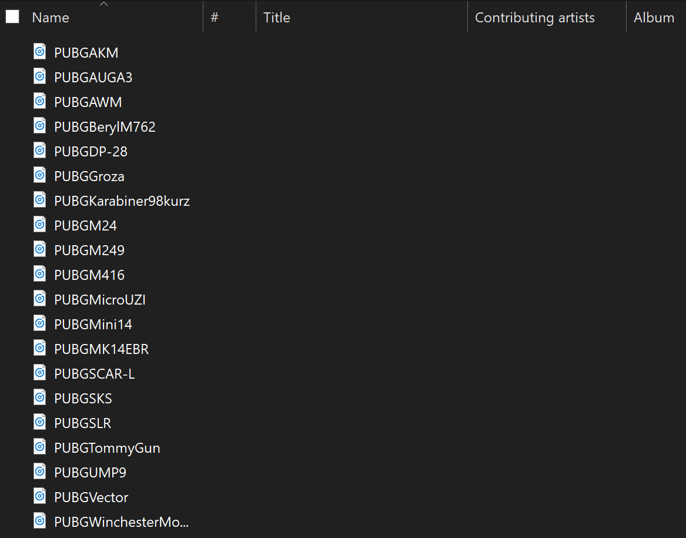

# Entry 3
##### 1/5/20

## Engineering Design Process:
For the past few weeks, I have shifted most of my focus from [Android Studio](https://developer.android.com/docs) to creating the content of my app. Knowing that there will be a considerable amount of content that I will have to create since I want to be as specific as possible with everything about [PUBG](https://documentation.pubg.com/en/index.html), and that content will take up the most amount of work as opposed to tinkering with Android Studio, I have decided to halt the learning process of Android Studio for later and focused more on creating the content of my app on a [Google Doc](https://www.google.com/docs/about/). I also did this because I prefer to be consistent with the project by focusing on one thing at a time, rather than being inconsistent and bouncing back and forth with creating the content and tinkering with Android Studio. I've also been playing PUBG more often than usual so that I can see what tips and other things I can find to include in my app, since most of the content will be from my own personal experience of playing the game. Lastly, I have recorded and edited all of the gun audio from PUBG for my PUBG gun sound quiz with [Audacity](https://www.audacityteam.org/help/documentation/). 

## Knowledge and Skills:
Currently in APCSA, we have learned the constructor, classes, methods, and creating objects. Of these, classes will be the most practical for my app since I could have multiple classes that each have their own role, and I do not have to have all the code on one file. As for the skills, I have realized that creating the content is a very tedious process since I am being extremely specific will the guide, almost to the point where the guide is readable for someone that have never played PUBG in their life. For instance, in my guide, I have included a gun guide for each gun in the game, which took a while since there is a lot of guns in the game. I have also included an attachment guide for each attachment in the game, which also took a while since there is a lot of attachments in the game, and there are other sub topics that should be mentioned and explained with attachments, such as Muzzles, Magazines, and horizontal and vertical recoil. To make things easier for me, I have decided to break down all of the content by spreading out my work throughout multiple weeks, rather than doing everything at the end.

[Previous](entry02.md) | [Next](entry04.md)

[Home](../README.md)