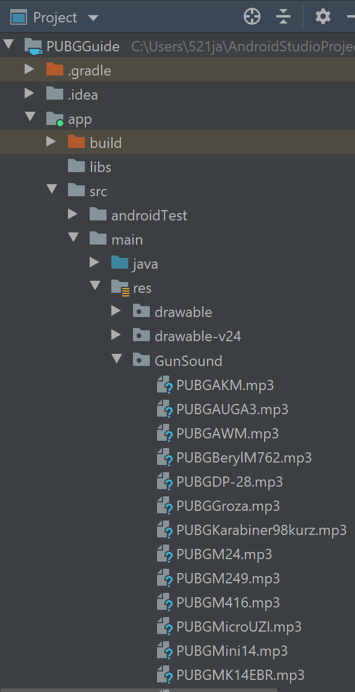

# Entry 5
##### 3/13/20

## Engineering Design Process

Currently, I am on step 6 on the Engineering Design Process, test and evaluate the prototype, and am coming close to step 7, improve as needed. I have completed the MVP since I have finish making all the content, creating all the buttons so that the user can navigate through the app, and implementing all the content into my app. As I was implementing all the content into my app, I've realized that some screens had so much content that the text would get cut off at the bottom, so I had to enable a [scroll functionality](https://stackoverflow.com/questions/6305602/how-to-enable-scrolling-functionality-to-linear-layout-in-android) to allow the user to scroll through the content. Now, I had started my gun sound multiple choice quiz, where when the user clicks on a button, a gun sound will play, and the user will have to choose which gun it is. I have been using youtube tutorials to help me on [how to make a button play a gun sound](https://www.youtube.com/watch?v=9oj4f8721LM), with some additional help on [Stack Overflow](https://stackoverflow.com/questions/18459122/play-sound-on-button-click-android). Although I am not done with the quiz, it is something that is not too urgent to finish since I have completed the MVP

## Knowledge

Firstly, we had to open the layout of our quiz and drag a button onto the layout. This button will be used to play a gun sound when the user clicks on it.

```java
<Button
        android:id="@+id/AWMsound"
        android:layout_width="149dp"
        android:layout_height="77dp"
        android:text="@string/play_gun_sound"
        tools:layout_editor_absoluteX="131dp"
        tools:layout_editor_absoluteY="170dp" />
```

On the Android view, we right click res > New > Android Resource Directory and rename that directory. Then we change the view from Android to Project and go to app > src > main > GunSound (name of your directory) and then we click right click GunSound > Show in Explorer > GunSound. We then drag the audio files we want inside of the folder to make the audio files show up inside Android Studio.




In the ```onCreate``` method in our class, we add

```java
final MediaPlayer AWM = MediaPlayer.create(this, R.GunSound.PUBGAWM);
```

This will make the AWM name have the properties of a MediaPlayer. The MediaPlayer will go to the GunSound directory and target the PUBGAWM audio file.

We then have to creating an object of a Button type, cast it as a Button type, and reference it to the play_gun_sound button.

```java
Button playAWMSound = (Button) findViewById(R.id.AWMsound);
```

Lastly, we set a ```setOnClickListener``` to make the button play the gun sound when it is clicked.

```java
playAWMSound.setOnClickListener(new View.OnClickListener() {
            @Override
            public void onClick(View v) {
                AWM.start();
            }
});
```

This enables the user to play the gun sound when the button is clicked, and can click on the button multiple times to play the sound multiple times.

## Skills

**Problem decomposition** was important in building the app since by breaking the task in smaller pieces, it would be much easier to fulfill the MVP. By splitting up the work I needed to do into smaller sections, I could finish the work much faster than by not having a plan at all. In addition, **organization** was very important in building the app since I have many different files from each topic, and I will have even more files from the gun sound quiz. To improve this, I had created folders for each topic to organize each file.

[Previous](entry04.md) | [Next](entry06.md)

[Home](../README.md)